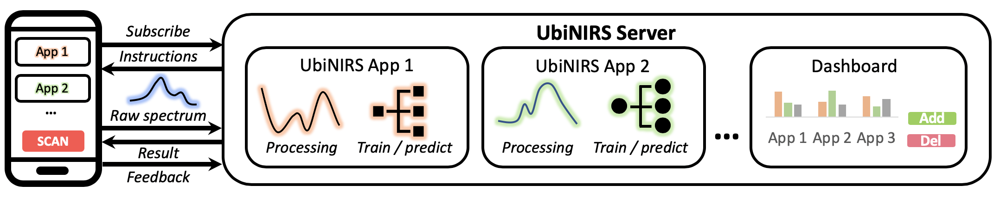
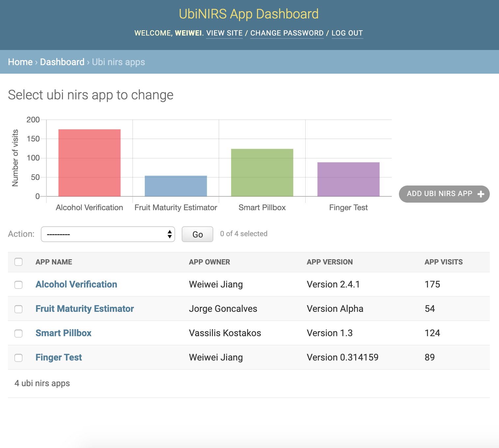
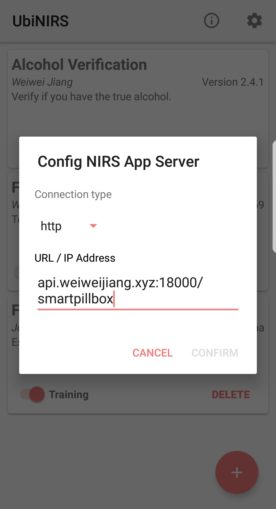

# UbiNIRS
A tool kit to quick-start NIRS applications without coding. 

## Architecture 


Definitions

- UbiNIRS App: An Django app running on the server, which performs a specific task using NIRS, such as identifying pills using NIRS.

## Dependencies (server)
```shell
pip install django django-extensions django-nested-admin django-cleanup numpy joblib scipy scikit-learn===0.22.1 matplotlib pandas
```
or 
```shell
cd UbiNIRS
pip install -r requirements.txt
```
Note: Only tested in Linux, requiring some tweaks for Windows / MacOS. 

## Quick start 
### Server side
#### Start server
```shell
cd src/django_server/nirs_server
python manage.py runserver 0.0.0.0:18000
```
- In your web browser, visit the URL: _server_ip_address_:18000/admin/
- The default username is _admin_, password is _ubinirsadmin_

#### Create new NIRS apps
To create new NIRS apps, simply go to the dashboard, then click "ADD UBI NIRS APP".



### Android app side 
- Compile and install the app through Android Studio, or use the pre-compiled [apk](src/android/app/build/outputs/apk) file.
- Click the add button on the bottom-right corner. 
- Input the URL shown in the server side with NIRS-app name. By default, the URL for the app is the lower-cased and no-white-space app name (e.g., _server_ip_port_/smartpillbox for the "Smart Pillbox" app).



## To be implemented
#### Security 
- Currently the secret key is hardcoded in the source file, please use system environment for practical use [[reference](https://docs.djangoproject.com/en/3.2/howto/deployment/checklist/#secret-key)]. 

- There is no authentication for NIRS app access. Considering adding authentication tokens (such as via user log-in) with _https_ protocal.

#### Deployment
- For long-term running, please consider a WSGI or an ASGI server [[reference](https://docs.djangoproject.com/en/3.2/howto/deployment/)].

## Related tools 
- [NIRScanner-Python](https://github.com/HighTemplar-wjiang/NIRScanner-Python): A python library for NIRScan Nano. 
- [NIRScan-Nano-Firmware](https://github.com/HighTemplar-wjiang/NIRScan-Nano-Firmware): A customized firmware for NIRScan Nano to enable Bluetooth after the device is on.
